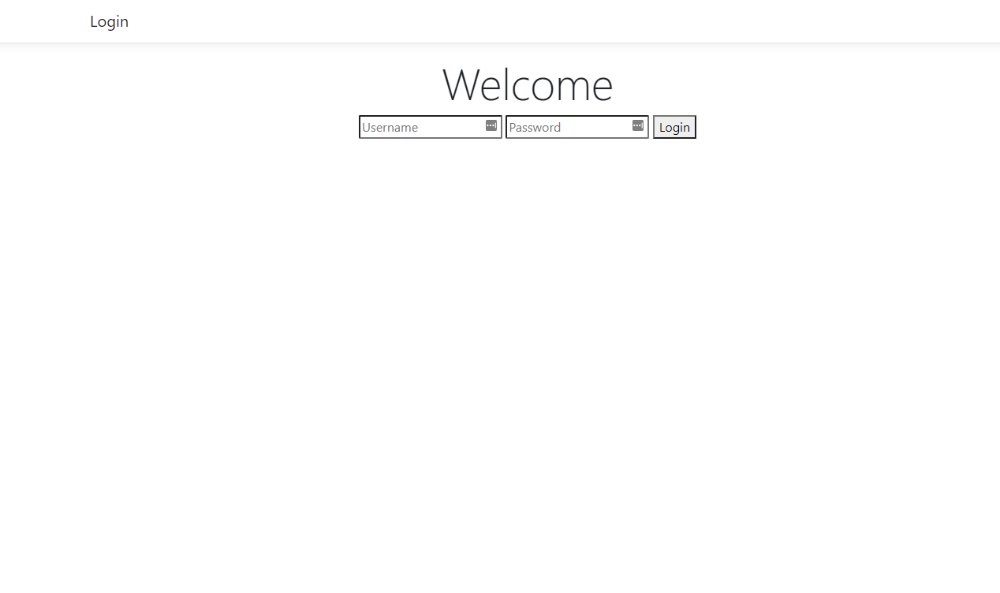
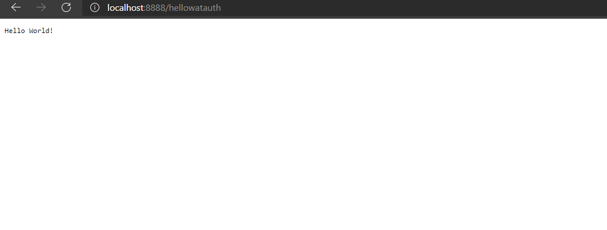
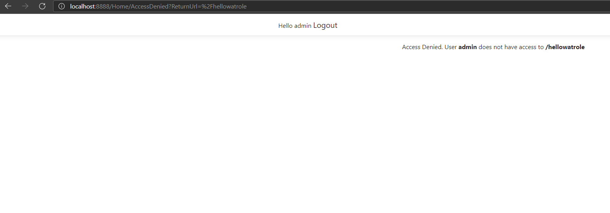

# WATM Hello World! WAGI Module with Authorization

This example shows how to restrict access to a WAGI Module based on ASP.Net Authentication and Authorization.

Clone the repo, switch to the examples/watmwithauth folder and then run:

``` Console
dotnet run
```

This starts a ASP.Net Core Web application WAGI host on port 8888.

Use a browser to navigate to http://localhost:8888/hellowatauth, this module requires that you are logged in so you should be redirected to a login page:



Now login using username `admin` password `admin` you should now be redirected to the hellowatauth endpoint:



Now navigate to  http://localhost:8888/hellowatrole, this module requires that the logged in user is a member of the role superadmin, you should be redirected to an access denied page:



Click on logout at the top of the screen and login again using username `superadmin` password `admin`.

Now navigate to http://localhost:8888/hellowatrole again and you should see the output ```Hello World!``` again.

Now navigate to http://localhost:8888/hellowatpolicy  this module requires that the logged in user satisfies a policy ```IsSpecial``, you should be redirected to an access denied page again.

Click on logout at the top of the screen and login again using username `specialadmin` password `admin`.

Now navigate to http://localhost:8888/hellowatpolicy again and you should see the output ```Hello World!``` again.

The configuration for this is example can be found in the [appsettings.Development.json](appsettings.Development.json) configuration file:

``` json
  // The name of the configuration section for the WAGI route handler, by default this is expected to be called Wagi.
  "Wagi": {
    // The relative path to the directory where WAGI modules defined in this configuration section are located.
    "ModulePath": "modules",
    // A dictionary of one or more modules to be exposed by the application
    "Modules": {
      // The logical name of the module definition
      "hellowatauth": {
         // The file name of the module.
        "FileName": "hello.wat",
        // Setting Authorize to true requires that users are logged in to access the endpoint.
        "Authorize" : true,
        // Route that is appended to the url of the server to form the URL to access the module
        "Route" : "/hellowatauth"
      },
      "hellowatrole": {
        "FileName": "hello.wat",
         // Setting Roles is a list of role names that the logged in user must be a member of to access the endpoint.
        "Roles" : ["superadmin"],
        "Route" : "/hellowatrole"
      },
      "hellowatpolicy": {
        "FileName": "hello.wat",
         // Setting Policies is a list of policy names that the logged in user must satisfy to access the endpoint.
        "Policies" : ["IsSpecial"],
        "Route" : "/hellowatpolicy"
      }
    }
  }

```

The host web application must be configured to enable authentication and authorization, this can be seem in the example in [Startup.cs](Startup.cs). The login controller is at [HomeController.cs](./Controllers/HomeController.cs).
